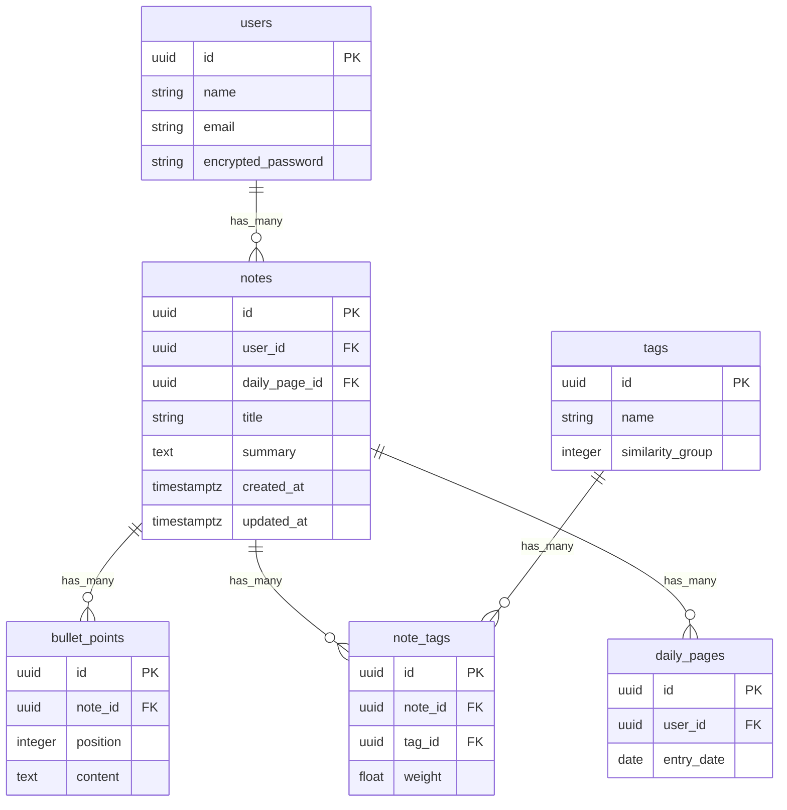

# アーキテクチャ設計

## 全体像
- **フロントエンド**: Vue 3 (Composition API) + Vite + TypeScript。
- **状態管理**: Pinia。メモ一覧、フィルタ条件、ユーザー設定などを集中管理。
- **UI ライブラリ**: Vuetify または Element Plus。アクセシビリティとレスポンシブ対応を重視。
- **バックエンド**: Rails 7 (API モード) + PostgreSQL。GraphQL を採用し柔軟なデータ取得を実現。
- **認証**: Devise + JWT。ブラウザ側は HTTP-only Cookie を使用。
- **要約処理**: Sidekiq + Redis による非同期ジョブ。OpenAI API を利用した抽出型要約を想定。

## データモデル

## API エンドポイント (GraphQL)
- `query notes(date: Date, tagId: ID): [Note!]` – 日付やタグでメモをフィルタ。
- `mutation createNote(input: NoteInput!)` – 箇条書きメモを保存。
- `mutation requestSummary(noteId: ID!)` – 要約ジョブをキューに追加。
- `subscription summaryUpdated(noteId: ID!)` – 要約完了のリアルタイム通知。

## バックグラウンドジョブ
1. `NoteSummarizationJob`
   - bullet_points からテキストを構成
   - OpenAI API へ要約リクエスト
   - 結果を `notes.summary` に保存
2. `TagSuggestionJob`
   - Embedding ベクトルのコサイン類似度を計算
   - しきい値を超えるタグを `note_tags` として作成
   - 類似度が高いノートを `related_note_ids` に保存 (キャッシュ)

## キャッシュ戦略
- Redis を用いて `daily_pages` ごとの note IDs をキャッシュ。
- フロントからのアクセスは `ETag` を利用して差分同期。

## デプロイ
- Backend: Render または Fly.io。Sidekiq Worker を別プロセスで配置。
- Frontend: Vercel または Netlify。
- CI/CD: GitHub Actions で RSpec・ESLint・Cypress を実行。
