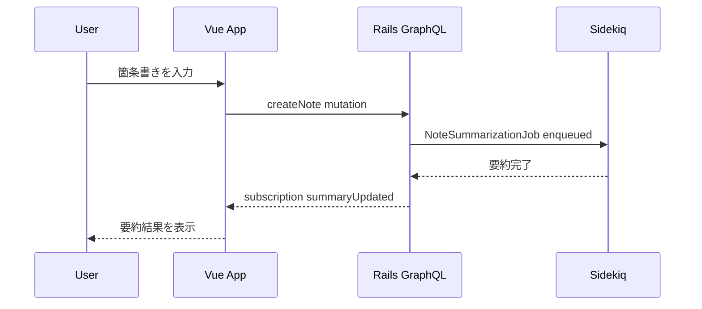

# フロントエンド UI / UX ガイド

## ページ構成
1. **ダッシュボード**
   - 日付ごとのメモカードをタイムライン状に表示。
   - カレンダーコンポーネントで特定日へジャンプ可能。
   - 要約状態をプログレスバーで視覚化。
2. **メモエディタ**
   - 箇条書き入力フィールド (Enter で次の項目を追加、ドラッグ&ドロップで並び替え)。
   - 要約プレビューを右側パネルに表示。
   - 類似タグ候補を Chips コンポーネントで提示。
3. **タグブラウザ**
   - タグクラウドと、タグに紐づく日付ページ一覧。
   - 類似タグをグラフ表示する Force Layout (D3.js)。

## コンポーネント設計
- `DailyTimeline.vue`: 指定範囲の日付ページをカードとして描画。
- `NoteCard.vue`: 要約・タグ・ bullet list のサマリを表示。
- `BulletEditor.vue`: Reorderable List を実装。`vuedraggable` を利用。
- `SummaryPanel.vue`: 要約テキストとステータス表示。
- `TagSuggestions.vue`: 類似タグと関連メモを提案。

## 状態フロー

## アクセシビリティ
- キーボード操作だけで箇条書きの追加・並び替えができるよう、ショートカットと `aria-grabbed` 属性を実装。
- カラーコントラスト比は 4.5:1 以上を維持。
- 読み上げ向けに要約完了時は `aria-live="polite"` な領域へ挿入。

## レスポンシブ設計
- 768px 未満ではタイムラインを縦スクロールに変更。
- サマリーパネルはモーダル化し、タグ候補は水平スクロール可能な Chips に。

## テスト戦略
- 単体: Vue Test Utils + Vitest。
- E2E: Cypress で要約完了フロー・タグ閲覧フローを検証。
